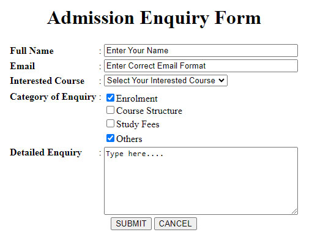
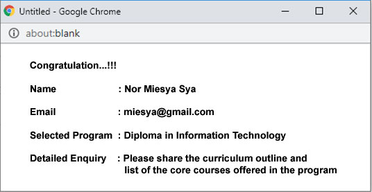
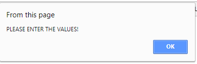

<h3 style="text-align: center;">Question</h4>
  

#### PURPOSE

The purpose of this assignment is to assess the learner’s knowledge and understanding of basic web development as well as the practical aspects of creating online forms and writing code using JavaScript.

#### REQUIREMENT / ASSIGNMENT QUESTION

#### QUESTION 1

You have been appointed as a consultant to develop a website for training institution that offers professional development programs. The primary goal of the website is to present the available training courses to prospective participants, providing information such as course descriptions, course structure, duration, fees, and scheduling. The website should be structured to highlight the value of these training programs through a diverse range of media, including images and videos, and to offer valuable insights such as course-specific recommendations, prerequisites, and learning methodologies. Additionally, the website should incorporate functionalities like participant testimonials, inquiry forms, and registration capabilities. 

The following tasks are required for the website development:
1. Suggest any attractive title for the website.
2. Organise the information presented by using the table layout.
3. Use appropriate graphics or images, colours, texts and fonts.
4. Provide ONE page to describe your information as a developer of the website, such as experience, address, contact number and other relevant information.
5. The website should also have ONE Visitors Page that provides an enquiry form for visitors to find out more about the training courses. This page will be linked to the Visitor Form in QUESTION 2.
6. Develop the website using HTML by having at least 5-7 pages.

#### QUESTION 2

Use HTML and JavaScript to create an online registration form to allow the visitor or prospective to post any question about the training programs as shown in Figure 1 (Sample form).  When the visitor clicks the “Submit” button, the output will be displayed as shown in the Figure 2 (Sample of data displayed).

  

Figure 1: Sample Form

 

Figure 2: Sample of Data Displayed
  

The visitors must fill up each of the required fields in the enquiry form. If the form does not receive any input, you need to use a pop-up alert window to request the user to enter the values (refer to sample in Figure 3).   

  

Figure 3: Sample Alert 
  

<h3 style="text-align: center;">End Of Question</h4>

#### Refference
[mdn-mozilla](https://developer.mozilla.org/en-US/docs/Learn/Forms/Your_first_form)